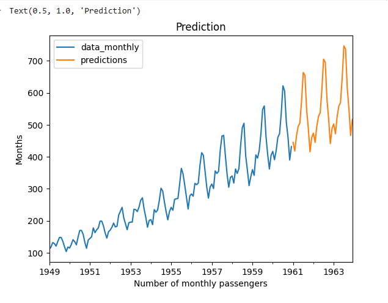

## Devloped by: Sreevalsan V
## Register Number: 212223240158
## Date: 8-03-2025

# Ex.No: 08     MOVINTG AVERAGE MODEL AND EXPONENTIAL SMOOTHING

### AIM:
To implement Moving Average Model and Exponential smoothing Using Python.

### ALGORITHM:
1. Import necessary libraries
2. Read the CSV file.
3. Display the shape and the first 10 rows of the dataset
4. Perform rolling average transformation with a window size of 5 and 10 
5. Display first 10 and 20 values repecively and plot them both
6. Perform exponential smoothing and plot the fitted graph and orginal graph

### PROGRAM:

```py
import numpy as np
import pandas as pd
import matplotlib.pyplot as plt
import warnings
from statsmodels.tsa.holtwinters import ExponentialSmoothing
```
Read the AirPassengers dataset
```py
data = pd.read_csv('AirPassengers.csv')
```
Focus on the '#Passengers' column
```py
passengers_data = data[['#Passengers']]
```
Display the shape and the first 10 rows of the dataset
```py
print("Shape of the dataset:", passengers_data.shape)
print("First 10 rows of the dataset:")
print(passengers_data.head(10))
```
Plot Original Dataset (#Passengers Data)
```py
plt.figure(figsize=(12, 6))
plt.plot(passengers_data['#Passengers'], label='Original #Passengers Data')
plt.title('Original Passenger Data')
plt.xlabel('Date')
plt.ylabel('Number of Passengers')
plt.legend()
plt.grid()
plt.show()
```
Moving Average
Perform rolling average transformation with a window size of 5 and 10
```py
rolling_mean_5 = passengers_data['#Passengers'].rolling(window=5).mean()
rolling_mean_10 = passengers_data['#Passengers'].rolling(window=10).mean()
```
Display the first 10 and 20 vales of rolling means with window sizes 5 and 10 respectively
```py
rolling_mean_5.head(10)
rolling_mean_10.head(20)
```
Plot Moving Average
```py
plt.figure(figsize=(12, 6))
plt.plot(passengers_data['#Passengers'], label='Original Data', color='blue')
plt.plot(rolling_mean_5, label='Moving Average (window=5)')
plt.plot(rolling_mean_10, label='Moving Average (window=10)')
plt.title('Moving Average of Passenger Data')
plt.xlabel('Date')
plt.ylabel('Number of Passengers')
plt.legend()
plt.grid()
plt.show()
```
Perform data transformation to better fit the model
```py
data_monthly = data.resample('MS').sum()   #Month start
scaler = MinMaxScaler()
scaled_data = pd.Series(scaler.fit_transform(data_monthly.values.reshape(-1, 1)).flatten(),index=data.index)

```
Exponential Smoothing
```py
# The data seems to have additive trend and multiplicative seasonality
scaled_data=scaled_data+1 # multiplicative seasonality cant handle non postive values, yes even zeros
x=int(len(scaled_data)*0.8)
train_data = scaled_data[:x]
test_data = scaled_data[x:]

model_add = ExponentialSmoothing(train_data, trend='add', seasonal='mul').fit()

test_predictions_add = model_add.forecast(steps=len(test_data))

ax=train_data.plot()
test_predictions_add.plot(ax=ax)
test_data.plot(ax=ax)
ax.legend(["train_data", "test_predictions_add","test_data"])
ax.set_title('Visual evaluation')

np.sqrt(mean_squared_error(test_data, test_predictions_add))

np.sqrt(scaled_data.var()),scaled_data.mean()
```
Make predictions for one fourth of the data
```py
model = ExponentialSmoothing(data_monthly, trend='add', seasonal='mul', seasonal_periods=12).fit()
predictions = model.forecast(steps=int(len(data_monthly)/4)) #for next year
ax=data_monthly.plot()
predictions.plot(ax=ax)
ax.legend(["data_monthly", "predictions"])
ax.set_xlabel('Number of monthly passengers')
ax.set_ylabel('Months')
ax.set_title('Prediction')

```

### OUTPUT:

Original data:


Moving Average:- (Rolling)

window(5):


window(10):


plot:


Exponential Smoothing:-

Test:


Performance: (MSE)


Prediction:




### RESULT:
Thus we have successfully implemented the Moving Average Model and Exponential smoothing using python.
